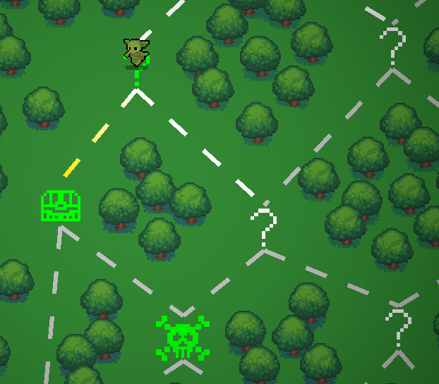
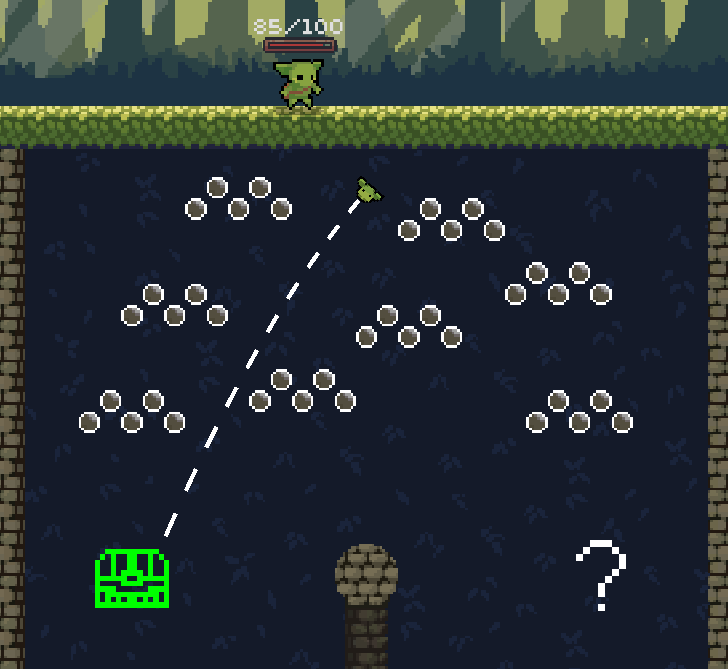

# Peglin GPS

This is a mod for Peglin that lets you click nodes on the map 
to turn them green. They will then show green on the navigation 
screen as well, so you don't need to open the minimap every time.

This mod is imperfect and comes with no warranties. It may break 
your game, prevent you from creating new savefiles, crash your computer, 
or set your house on fire.

## Installation guide
You can download the mod from [Thunderstore](https://peglin.thunderstore.io/).   
See https://mods.pegl.in/ for links to the Discord and more.